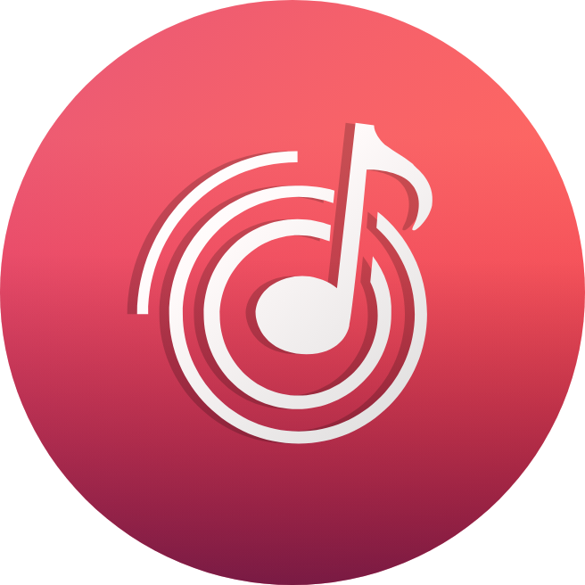

# Wynk Clone - React Project



## Introduction

This repository contains the code for a Wynk Clone, a music streaming web application developed using React. This project aims to replicate some of the core features and functionalities of the popular music streaming platform Wynk.

**Hosted On:** [https://wynk-music-1029.vercel.app/](https://wynk-music-1029.vercel.app/)

## Project Images

-   Home Page:
    
-   Playlist Management:
    
-   My Music Page:
    
-   Subcription Page:
    

## Features

-   **User Registration and Authentication**

    -   Users can create accounts or log in using their existing credentials.
    -   Authentication is powered by Newton School API for secure and seamless user management.

-   **Browsing and Searching for Songs**

    -   Users can browse through a vast catalog of songs and albums.
    -   A search feature allows users to find specific songs quickly.

-   **Music Playback**

    -   Users can play and pause songs with the click of a button.
    -   The player displays the current song's title, artist, and album.

-   **Liking and Disliking Songs**

    -   Users can like or dislike songs to influence their personalized recommendations.
    -   Liked songs are added to the user's liked songs playlist.

-   **Discovering New Music**

    -   Users can explore trending songs and discover new releases.
    -   This feature helps users stay up-to-date with the

## Technologies Used

-   React
-   Redux for State Management
-   Tailwind CSS for Styling
-   JavaScript for Logic

## Installation

Follow these steps to set up and run the project on your local machine:

1. Clone the repository to your local machine using Git:

```bash
git clone https://github.com/omkarmhadgut29/Wynk-Clone---React-Project-2---asghq9fp99o7.git
```

2. Change the working directory to the project folder:

```bash
cd Wynk-Clone---React-Project-2---asghq9fp99o7
```

3. Install the project dependencies:

```bash
npm install
```

4. Start the development server:

```bash
npm start
```

5. Open your web browser and visit `http://localhost:3000` to see the Wynk Clone app running locally.

## Usage

-   Register or log in to your account.
-   Explore the music catalog and search for songs.
-   Play and manage your playlists.
-   Like and dislike songs to personalize your recommendations.
-   Enjoy listening to music!

## Contributing

Contributions are welcome! If you'd like to contribute to this project, please follow these steps:

1. Fork the repository.
2. Create a new branch for your feature or bug fix.
3. Make your changes and commit them with clear, concise commit messages.
4. Push your changes to your forked repository.
5. Create a pull request to merge your changes into the main repository.

## License

This project is licensed under the MIT License - see the [LICENSE](LICENSE) file for details.

## Acknowledgments

-   This project was inspired by the Wynk music streaming platform.
-   Special thanks to the open-source community for providing valuable resources and libraries.

## Contact

If you have any questions or need further assistance, feel free to contact the project owner:

-   Name: Omkar Mhadgut
-   Email: omkarmhadgut10@gmail.com

You can also open an issue on this repository for any inquiries or problems you encounter.

Thank you for using the Wynk Clone React Project! Enjoy your music streaming experience.
